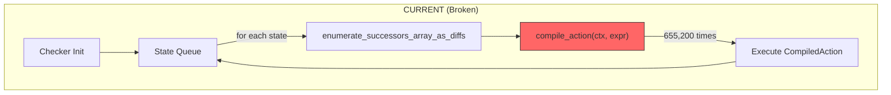
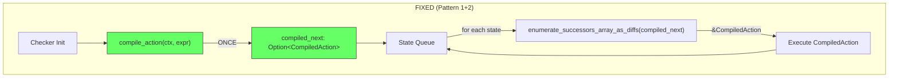
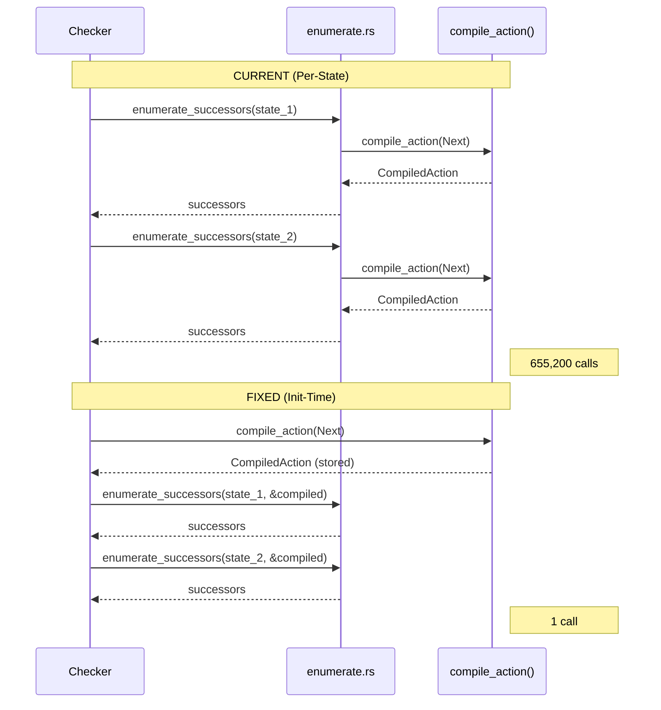

# Action Caching Architecture

Last updated: 2026-01-20
Commit: 212ff74 (full: 212ff74c0f5a7c1e4d8f6b3a9e2c1d0f8a7b6c5d)
Covers: crates/tla-check/src/check.rs, crates/tla-core/src/enumerate.rs

## Problem: Per-State Recompilation



**Issue:** `compile_action()` called for EVERY state (O(n) where n = state count).
- MCBakery: 655,200 states = 655,200 compilations
- 89% regression vs non-compiled path

## Solution: Initialization-Time Caching



**Fix:** Compile ONCE at initialization, pass reference to enumeration.
- O(1) compilation regardless of state count
- Expected: MCBakery < 35s (vs 72.7s compiled, 38.5s default)

## Data Flow Comparison



## Cross-Repo Pattern Sources

| Pattern | Source | Application |
|---------|--------|-------------|
| Guard-protected init | z4 `EufSolver.func_apps_init` | `Option<CompiledAction>` |
| Cache-first lookup | kani_fast `function_cache` | Parameter pass-through |
| Init-time compile | TLC `Tool.java:224-234` | Checker initialization |

## Code Locations

### Current (Problematic)
```
enumerate.rs:3959
    fn try_enumerate_with_compiled_action(...) {
        let compiled = compile_action(ctx, expr, registry);  // EVERY state
    }
```

### Target (Fixed)
```
check.rs (initialization):
    let compiled_next = compile_action(&ctx, &next_def.body, &registry);

enumerate.rs (signature change):
    fn enumerate_successors_array_as_diffs(
        compiled_next: Option<&CompiledAction>,  // Pre-compiled
        ...
    )
```

## Citations

- `crates/tla-core/src/enumerate.rs:3959` - Current per-state compilation
- crates/tla-check/src/check.rs - Checker initialization location
- `~/tlaplus/tlatools/org.lamport.tlatools/src/tlc2/tool/impl/Tool.java:224-234` - TLC action caching
- `~/z4/crates/z4-theories/euf/src/lib.rs:109-190` - Guard pattern source
- `~/kani_fast/crates/kani-fast-compiler/src/codegen_chc/mod.rs:227-275` - Cache-first pattern

## Change Log

- 2026-01-20 (212ff74): Created diagram documenting #347 architecture
