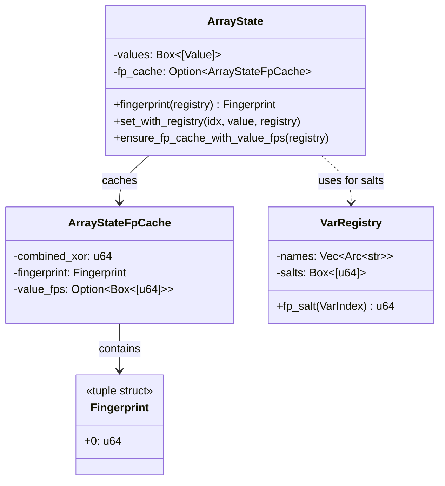
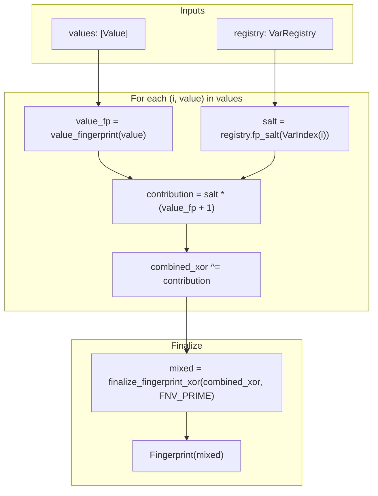
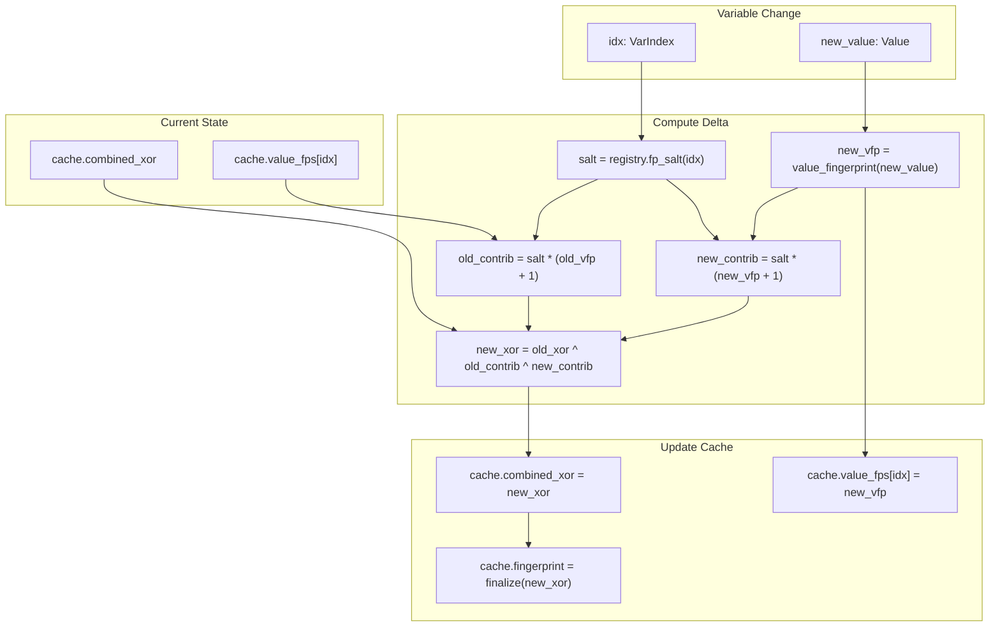
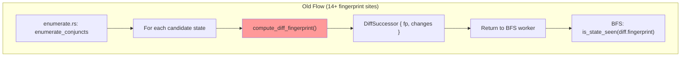
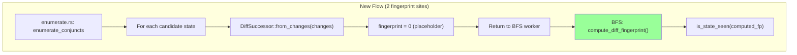

# Fingerprinting Subsystem

Last updated: 2026-01-17 (RESEARCHER - corrected implementation status)
Commit: 26fa662 (infrastructure), call sites NOT migrated
Covers: `crates/tla-check/src/state.rs:1200-1600`, `crates/tla-check/src/check.rs:2721-2750`

## Overview

Fingerprinting provides O(1) state deduplication by computing a 64-bit hash of state variable values. This is critical for model checking performance - without efficient deduplication, state space exploration would be exponentially slower.

## Fingerprint Data Structure



## Fingerprint Computation Algorithm



## Incremental Update Algorithm

When a single variable changes, we can update the fingerprint incrementally instead of recomputing from scratch.



## Critical Code Paths

### 1. Fresh Computation (`fingerprint`)
```
state.rs:1438-1464
- Called when fp_cache is None
- Computes combined_xor from all values
- Caches result for future use
```

### 2. Cache Population (`ensure_fp_cache_with_value_fps`)
```
state.rs:1507-1556
- Populates value_fps array for incremental updates
- CRITICAL: Must recompute combined_xor if copying from another state
- Bug #132 was here: failed to recompute combined_xor
```

### 3. Incremental Update (`set_with_registry`)
```
state.rs:1394-1436
- XOR out old contribution, XOR in new contribution
- Requires valid combined_xor and value_fps
- O(1) per variable change vs O(n) full recomputation
```

### 4. State Copy (`from_state_with_fp`)
```
state.rs:1333-1359
- Creates ArrayState from State, copying fingerprint
- Sets combined_xor=0 (not used for initial fingerprint)
- REQUIRES ensure_fp_cache_with_value_fps before set_with_registry
```

## Bug #132 Analysis

```mermaid
flowchart TD
    subgraph Bug["Bug Path (Pre-Fix)"]
        B1["from_state_with_fp() sets combined_xor=0"]
        B2["ensure_fp_cache_with_value_fps() adds value_fps"]
        B3["set_with_registry() uses combined_xor=0"]
        B4["Wrong fingerprint!"]
    end

    subgraph Fix["Fixed Path (Post-Fix)"]
        F1["from_state_with_fp() sets combined_xor=0"]
        F2["ensure_fp_cache_with_value_fps() RECOMPUTES combined_xor"]
        F3["set_with_registry() uses correct combined_xor"]
        F4["Correct fingerprint"]
    end

    B1 --> B2
    B2 --> B3
    B3 --> B4

    F1 --> F2
    F2 --> F3
    F3 --> F4

    style B4 fill:#f99
    style F4 fill:#9f9
```



## Invariants (For Formal Verification)

**FP-1: Determinism**
```
forall s1, s2 : ArrayState
    values(s1) == values(s2) => fingerprint(s1) == fingerprint(s2)
```

**FP-2: Cache Consistency**
```
forall s : ArrayState with fp_cache = Some(c)
    recompute_combined_xor(s.values, registry) == c.combined_xor
```

**FP-3: Incremental Correctness**
```
forall s : ArrayState, idx : VarIndex, v : Value
    let s' = s.set_with_registry(idx, v, registry)
    fingerprint(s') == fingerprint_from_scratch(values_with_update(s.values, idx, v))
```

## Performance Considerations

| Operation | Complexity | Notes |
|-----------|------------|-------|
| Fresh fingerprint | O(n) | n = number of variables |
| Incremental update | O(1) | Single variable change |
| Cache lookup | O(1) | Already computed |

For a typical spec with 5-10 variables and many successor states, incremental fingerprinting provides ~5-10x speedup over full recomputation.

## TLC Comparison

TLC (`TLCStateMut.java:171-272`) always recomputes fingerprints from scratch:
```java
long fp = FP64.New();
for (int i = 0; i < sz; i++) {
    fp = minVals[i].fingerPrint(fp);
}
```

TLA2's incremental approach is an optimization over TLC, but requires careful cache management (as #132 demonstrated).

## Deferred Fingerprinting Architecture (#228)

**Issue:** #228 - Deferred fingerprinting for performance gap fix

### Problem: Early Fingerprinting (Pre-#228)



### Solution: Deferred Fingerprinting (Post-#228)



### Key Changes

**STATUS (2026-01-17):** Infrastructure exists (uncommitted), call sites NOT migrated.

| Component | Current (Pre-#228) | Target (Post-#228) |
|-----------|-------------------|-------------------|
| enumerate.rs | 6 fingerprint calls | 0 fingerprint calls (TODO) |
| compiled_guard.rs | 6 fingerprint calls | 0 fingerprint calls (TODO) |
| check.rs (BFS worker) | Uses pre-computed fp | Computes fp before dedup |
| DiffSuccessor | Always has valid fp | fp=0 placeholder, computed in materialize() |
| state.rs from_changes() | N/A | ⚡ Uncommitted - creates placeholder fp |

### Why This Matters

TLC fingerprints ONCE per candidate state, in the worker thread, after enumeration is complete:
```java
// Worker.java:522-524
final long fp = succState.fingerPrint(tool);
final boolean seen = this.theFPSet.put(fp);
```

TLA2 was fingerprinting 3-5× per state during enumeration. For MCBakery N=3 (47M states):
- Old: ~47M × 4 = 188M fingerprint operations
- New: ~47M × 1 = 47M fingerprint operations
- Estimated savings: ~7 seconds

## Citations

- ArrayState definition: `crates/tla-check/src/state.rs:1247-1267`
- ArrayStateFpCache: `crates/tla-check/src/state.rs:1220-1245`
- fingerprint(): `crates/tla-check/src/state.rs:1438-1464`
- set_with_registry(): `crates/tla-check/src/state.rs:1394-1436`
- ensure_fp_cache_with_value_fps(): `crates/tla-check/src/state.rs:1507-1556`
- from_state_with_fp(): `crates/tla-check/src/state.rs:1333-1359`
- value_fingerprint(): `crates/tla-check/src/state.rs:1181-1218`
- Bug #132 fix: commit 746fe22
- Research report: reports/research/2026-01-14-fingerprint-bug-132-fix-strategy.md
- Formal verification design: designs/2026-01-14-formal-verification-strategy.md

## Change Log

- 2026-01-17 (RESEARCHER): Corrected status - infrastructure uncommitted, 12 call sites need migration
- 2026-01-17 (26fa662): Added deferred fingerprinting architecture documentation (#228)
- 2026-01-14 (7b192e0): Initial diagram documenting #132 fix and fingerprint invariants
