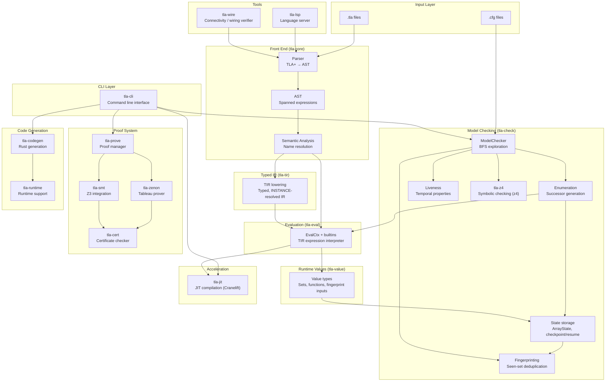
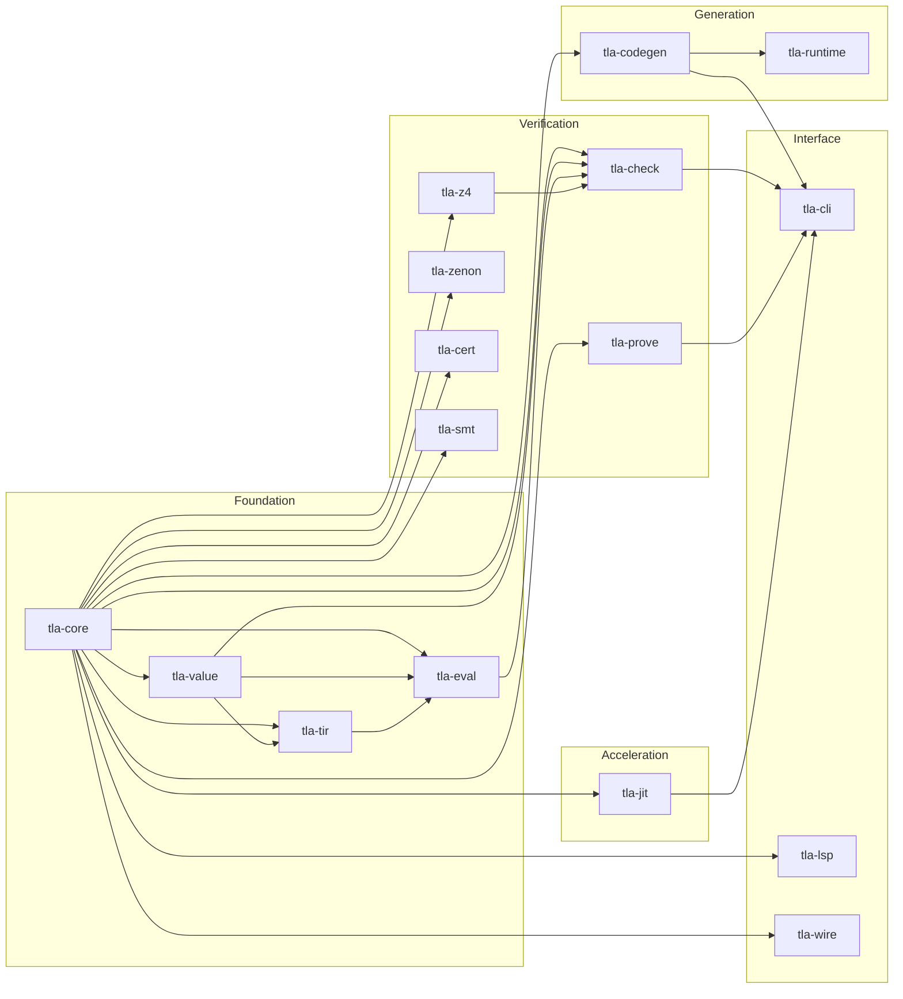
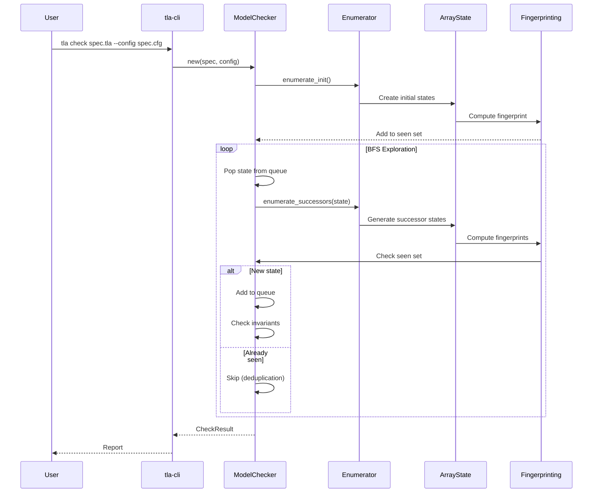

# TLA2 System Architecture

Last updated: 2026-03-21
Covers: All crates in `crates/`

## High-Level Architecture

## Crate Dependencies

## Data Flow: Model Checking

## Key Components

### tla-core
- **Parser**: Pest-based TLA+ parser
- **AST**: Spanned expression tree with source locations
- **Semantic analysis**: Name resolution, module wiring, and front-end checks

### tla-value / tla-tir / tla-eval
- **tla-value**: Runtime value types, hashing/fingerprinting support, and shared closure/value machinery
- **tla-tir**: Typed, INSTANCE-resolved IR used as the current expression-lowering boundary
- **tla-eval**: `EvalCtx`, builtins, LET/cache logic, and the active `eval_tir(...)` interpreter path

### tla-check
- **ModelChecker**: BFS/parallel state exploration
- **State storage**: `ArrayState`, sparse overlays, and checkpoint/resume state materialization
- **Fingerprinting**: TLC-compatible state fingerprinting for deduplication
- **Enumeration**: Successor generation for explicit-state checking
- **Liveness**: Temporal property checking via tableau + SCC detection

### tla-prove / tla-zenon / tla-cert
- **tla-prove**: High-level proof management
- **tla-zenon**: First-order tableau prover (Zenon algorithm)
- **tla-cert**: Proof certificate verification
- **tla-smt**: SMT-LIB translation for Z3

## Citations

- Workspace crate list: `Cargo.toml:3-19`
- `tla-eval` dependency split: `crates/tla-eval/Cargo.toml:9-11`
- `tla-check` dependency split: `crates/tla-check/Cargo.toml:10-14`
- `tla-cli` dependency on `tla-check`: `crates/tla-cli/Cargo.toml:18-33`
- Current evaluation-stack status: `README.md:572-575`

## Change Log

- 2026-01-14: Initial diagram created by RESEARCHER
- 2026-01-28: Add `tla-jit` and `tla-z4` to diagrams; remove static commit pin
- 2026-03-21: Refresh current-state value / TIR / evaluator layers; remove stale `CompiledGuard` architecture node
